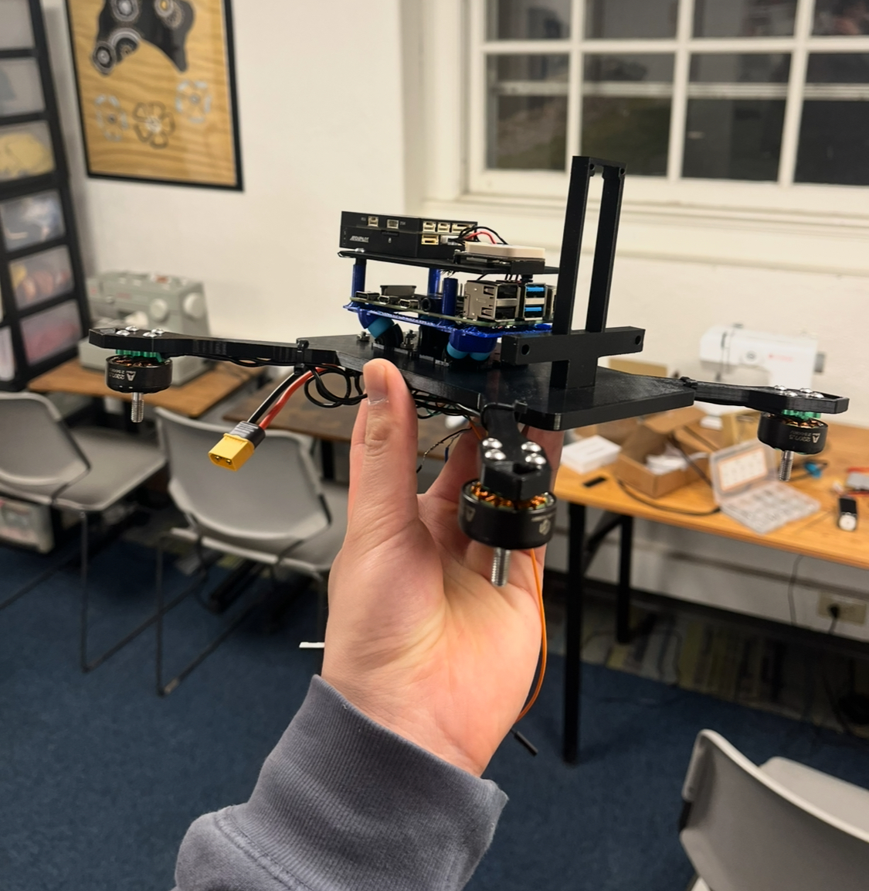

# Intercept Drone
### Background
According to CNN, there were 78 school shootings in the US in 2025.  Yet, students have no way of neutralizing the shooter. Instead, all they can do is lock doors and wait for the police, giving the shooter 5-10 minutes to inflict fatalities. We want to change that.

### Goal
Fully autonomous quadcopter that detects shooters and neutralizes them. 

### V1

First flight didn't go so well....

### Learnings
1. Balancing functionality with footprint. THe bigger our drone is, the easier it will be for the shooter to shoot it out of the sky. By using a Pixhawk 6c mini and a Raspberry Pi 4B, we would have had enough compute and built in sensors to achieve our goal, but our footprint ballooned.
2. Learning how to debug hardware, software and electrical. Our first ever ESC had really spotty communication. When testing a motor in QGC, sometimes it would throttle and sometimes it wouldn't. I realized this wasn't an ArduPilot parameter issue because I was able to throttle the motors some of the time. If it was an Ardupilot param issue, I wouldn't have been able to throttle the motors at all. Plus, when the ESC beeped using the motors, the motors would beep out of sync. 
3. Even if hardware data sheets say that it'll meet your specs, they can't be trusted. Ex: our second ESC had a 5V/3A BEC that we wanted to use to power our Pi, but the BEC didn't work. But if I had read online reviews prior to purchasing it, I would have realized that other people encountered the same issue.
